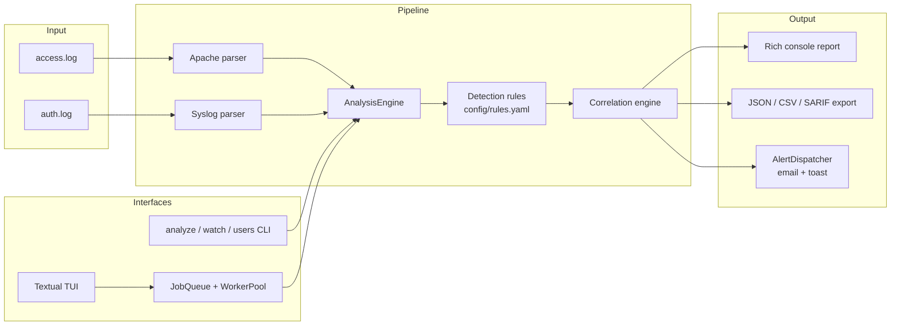

# security-log-analysis-tool

[](https://github.com/kveldulf1/security-log-analysis-tool/actions/workflows/ci.yml)
[](https://github.com/kveldulf1/security-log-analysis-tool/security/code-scanning)
[](https://www.python.org/)

A CLI + TUI tool that parses Apache-style access logs and syslog `auth.log` files,
detects suspicious activity (brute force, path traversal, SQLi probes, scanner
bursts, rate-limit abuse, sensitive `sudo` commands, SSH user enumeration), and
**correlates findings across both sources by IP** to surface multi-vector attacks
a single-log view would miss. Built as a 48-hour recruitment assessment with
production-shaped extras: role-scoped auth, a job queue for concurrent analyses,
a Textual TUI, JSON/CSV/SARIF export, email + desktop-toast alerting, an Allure
HTML regression report, and GitHub Actions / Jenkins pipelines.

> **Built with Claude Code.** Planned and implemented as a multi-session agentic
> workflow — 7 scoped sessions, dependency-gated, run in parallel git worktrees.
> The original brief, the plan and per-session prompts, and the verbatim
> conversation transcripts are committed under [`session-logs/`](session-logs/)
> (in `prompt/`, `plans/`, and `logs/`). See
> [AI-assisted development](#ai-assisted-development) for the details.

## Contents

- [AI-assisted development](#ai-assisted-development)
- [Features](#features)
- [Architecture](#architecture)
- [Install](#install)
- [Quickstart](#quickstart)
- [CLI usage](#cli-usage)
- [TUI usage](#tui-usage)
- [Configuration](#configuration)
- [Testing & regression suite](#testing--regression-suite)
- [Docker](#docker)
- [CI/CD](#cicd)
- [Performance & scaling](#performance--scaling)
- [Security notes](#security-notes)
- [Project layout](#project-layout)

## Features

- **Two parsers, one pipeline** — Apache combined-log and syslog `auth.log`,
  auto-detected per file, normalized to a common `LogEvent` (UTC-aware
  timestamps). Malformed lines are counted and WARNING-logged, never crash the run.
- **Configurable detection rules** (`config/rules.yaml`) — brute force (web +
  SSH), brute-force-then-success escalation, path traversal (raw + URL-decoded),
  SQL-injection probes, scanner bursts, rate-limit abuse, sensitive `sudo`
  commands, SSH invalid-user enumeration, rapid-success-after-failures. Every
  regex is anchored and ReDoS-reviewed.
- **Cross-source correlation** — the same IP hitting ≥2 distinct rules across
  ≥2 log sources inside a time window escalates to a `CRITICAL` correlated
  finding referencing its child findings.
- **Exit-code contract** (CI-friendly): `analyze` returns `0` = clean,
  `1` = at least one HIGH/CRITICAL finding, `2` = configuration/usage error.
- **Exports**: JSON, CSV, and SARIF 2.1.0 (schema-validated, repo-relative
  URIs) — SARIF feeds GitHub's Security → Code scanning tab directly.
- **Role-scoped auth** (`analyst` / `admin`) enforced at the service layer,
  scrypt password hashing, SQLite user store, 5-strikes/15-minute lockout.
- **Concurrency** — a bounded in-process job queue + worker pool for running
  several analyses at once, with explicit backpressure (no silent drops).
- **Watch mode** — tail-follow a live log file, incremental analysis as new
  lines arrive.
- **Textual TUI** — login, start/stop analyses, browse findings, tail tool
  logs with a live level filter; invalid input never exits the app.
- **Alerting** — a job's findings above a configured severity dispatch to
  email (SMTP/STARTTLS) and a Windows toast notification; a failing sink
  never fails the analysis.
- **Quality engineering**: pytest unit/e2e/perf/OWASP suites, a Gherkin/behave
  BDD regression suite, an Allure HTML report merging both, GitHub Actions
  (smoke + SARIF upload + Pages report) and a Jenkins pipeline (full
  regression, fails the build on a red suite), and a Dockerfile.

## Architecture



`pipeline/engine.py` streams events through the configured rules and the
correlation engine; nothing is fully materialized in memory for large files.
The job queue (`pipeline/queue.py`) is an interface, not a hard dependency —
see [Performance & scaling](#performance--scaling) for how it swaps to a
distributed broker in production.

## Install

Fresh-machine prerequisites, by feature area:

| Need | Requirement | Install |
|---|---|---|
| Run the tool at all | Python 3.11+ | [python.org](https://www.python.org/downloads/) or your OS package manager |
| Container build/run | Docker Desktop (or Docker Engine) | [docker.com](https://www.docker.com/products/docker-desktop/) |
| Local Allure HTML report | Java JRE/JDK | any JDK 11+; `scoop install allure` or `npm i -g allure-commandline` for the CLI |
| Local Jenkins pipeline | JDK + Jenkins (native or [Docker](https://www.jenkins.io/doc/book/installing/docker/)) + Allure Jenkins plugin | [jenkins.io](https://www.jenkins.io/download/) |

Clone and install (editable, with dev/test extras):

```bash
git clone https://github.com/kveldulf1/security-log-analysis-tool.git
cd security-log-analysis-tool
python -m pip install -e ".[dev]"
pre-commit install   # activates the ruff pre-commit hook
```

Using a virtual environment is recommended but not required:

```bash
python -m venv .venv
# Windows
.venv\Scripts\activate
# macOS/Linux
source .venv/bin/activate
python -m pip install -e ".[dev]"
```

## Quickstart

```bash
security-log-analysis-tool --version

# Analyze the committed sample logs — exits 1, both showcase correlations shown
security-log-analysis-tool analyze sample_logs/access.log sample_logs/auth.log

# A clean, benign-only log exits 0 with zero findings
security-log-analysis-tool analyze sample_logs/clean_access.log
```

## CLI usage

```
security-log-analysis-tool analyze FILES... [--rules PATH]
    [--format auto|apache|syslog] [--export json|csv|sarif] [--output PATH]
    [--no-alerts] [--min-severity low|medium|high|critical]
```

- `--rules` — path to a rules YAML (defaults to `config/rules.yaml`); an
  invalid file (bad YAML, unknown rule type, bad regex) exits `2` with an
  actionable message, never a traceback.
- `--format` — force a parser instead of auto-detecting per file.
- `--export/--output` — write findings to JSON, CSV, or SARIF 2.1.0.
- `--no-alerts` — skip the email/toast alert dispatch for this run.
- `--min-severity` — filter both the console report and any export.

Exit codes: `0` no HIGH+ finding · `1` at least one HIGH/CRITICAL finding ·
`2` configuration or usage error.

```bash
# Export SARIF for GitHub code scanning (see .github/workflows/ci.yml)
security-log-analysis-tool analyze sample_logs/access.log sample_logs/auth.log \
    --export sarif --output findings.sarif --no-alerts
```

Additional subcommands ship as the project grows via an auto-discovering
`commands/` registry (`cli.py` never changes to add one): `watch FILES...`
(tail-follow, incremental analysis), `tui` (see below), and
`users add|list|remove|seed-demo` (role-scoped account management). Run
`security-log-analysis-tool --help` for the exact set available in your
checkout.

## TUI usage

```bash
security-log-analysis-tool tui
```

If the `pip install -e` console script isn't on your `PATH` (e.g. Python's
per-user `Scripts` directory isn't on `PATH`), launch it PATH-independently:

```bash
python -c "from security_log_analysis_tool.cli import main; main()" tui
```

See a live run in [docs/e2e-report.md §6 — TUI walkthrough](docs/e2e-report.md#6-tui-walkthrough-visual-evidence).

Login (role-scoped: `analyst` / `admin`) → main menu: start an analysis, stop
a running/queued job, browse findings (severity-colored table), view tool
logs (prompts for a log level and filters live), logout, or quit (drains the
job queue gracefully — no leaked threads). Every screen validates input
in place; invalid input never exits the app, it re-prompts or returns to the
main menu. The demo accounts below exist **only** in tests/docs, never in
application logs or committed data:

| Username | Password | Role |
|---|---|---|
| `amelia.reyes` | `Password123!` | admin |
| `oscar.lindqvist` | `P@ssword123?` | analyst |

Seed them locally with `security-log-analysis-tool users seed-demo`.

## Configuration

**`config/rules.yaml`** — `version`, `defaults.window_seconds`,
`alerts.{min_severity, sinks}`, and a `rules[]` list (`id`, `type`, `enabled`,
`severity`, `source`, plus type-specific knobs like `threshold`,
`window_seconds`, `statuses`, `patterns`). Unknown rule types fail loudly at
load time with the list of valid types; regexes are anchored and
nested-quantifier-free by convention (ReDoS review — see
[Security notes](#security-notes)); overlong lines (>8 KB) are pre-truncated.

**`.env`** (copy from `.env.example`, gitignored — never commit it) — CLI
auth fallback (`SLAT_USERNAME`/`SLAT_PASSWORD`), SMTP alert credentials, and
log level. `.env.example` ships placeholders only.

## Testing & regression suite

```bash
python -m pytest -m smoke -q          # fast subset (~15 checks), what CI runs on every push
python -m pytest -q                    # full unit + e2e + perf + OWASP suite
python -m pytest -q -m "not perf"      # skip the concurrency/throughput perf suite
behave --tags=@smoke features          # BDD smoke slice
behave features                        # full Gherkin regression suite
```

Markers: `smoke` (fast, every push), `regression` (behavioural), `e2e`
(CLI subprocess / TUI Pilot), `perf` (concurrency/throughput, homework-scale),
`owasp` (OWASP Top 10 mapped tests). Every bugfix ships with a regression test.

> **Deferred (time-boxed assignment):** the CI/CD evidence in
> [`docs/e2e-report.md`](docs/e2e-report.md) §3–4 (GitHub Actions, SARIF, Pages,
> Jenkins) is **manual screenshots**, not an automated browser-UI test suite.
> Automated Playwright browser tests against the Jenkins and GitHub web
> interfaces were **not delivered** and remain a **TODO** — see
> [`docs/e2e-report.md`](docs/e2e-report.md) §7.

**Allure HTML report** (requires a JDK locally — CI never needs one):

```bash
python -m pytest -q --alluredir=allure-results
behave -f allure_behave.formatter:AllureFormatter -o allure-results features
allure generate allure-results -o allure-report --clean
allure open allure-report   # or open allure-report/index.html directly
```

Both runners write into the same `allure-results` directory, so the
generated report reads as one merged regression document (unit + BDD).

## Docker

```bash
docker build -t slat .

# Windows PowerShell — mount the committed sample logs read-only
docker run --rm -v "${PWD}\sample_logs:/logs:ro" slat analyze /logs/access.log /logs/auth.log
# exits 1, findings printed to stdout

docker run --rm -v "${PWD}\sample_logs:/logs:ro" slat analyze /logs/clean_access.log
# exits 0, zero findings

docker run --rm slat --help
# exits 0
```

The image is `python:3.12-slim`, single-stage (pure Python — nothing to
discard between build stages), and runs as a non-root `appuser`. No
`HEALTHCHECK`: this is a short-lived CLI invocation, not a long-running
service.

## CI/CD

**GitHub Actions** (`.github/workflows/ci.yml`), three jobs:

- `test` — on every push/PR: install, `ruff check`/`ruff format --check`,
  `pytest -m smoke`, `behave --tags=@smoke`, both into one `allure-results`
  directory, uploaded as an artifact.
- `allure-pages` — on `master` after `test` succeeds: renders the merged
  Allure report and publishes it to GitHub Pages (history/trend preserved
  across runs).
- `sarif` — analyzes the committed `sample_logs/` and uploads the SARIF
  output to **Security → Code scanning** (`security-events: write`); exit
  code `1` from `analyze` is the *expected* outcome here (findings present),
  not a workflow failure.

**Jenkins** (`Jenkinsfile`, native Windows agent — see
[docs/manual-tests.md](docs/manual-tests.md) for the one-time job setup):
polls SCM every 5 minutes (a local Jenkins has no public URL for a webhook),
sets up a fresh venv, then runs the **full** `pytest` + `behave` regression
suite — either failing fails the build (red), by design: a regression suite
that can't block a merge isn't doing its job. `post { always { allure ... } }`
publishes the Allure report via the Allure Jenkins plugin regardless of
outcome.

## Performance & scaling

The 20-concurrent-jobs perf test, throughput/memory-bound test, backpressure
test, and watch-mode sustained-ingestion test are deliberately scoped to
**homework scale** (see `tests/perf/`), not a production benchmark. The
production scaling story is architectural rather than a bigger number to
chase locally:

- `JobQueue`/`WorkerPool` are defined behind a small interface — swap in a
  distributed broker (Redis, SQS) and raise the worker count without
  touching callers.
- A hot parser (very high-volume ingestion) can be swapped to a
  Rust/Go implementation behind the same `Parser` protocol.
- Sharding by file/source is a natural next step once a single process's
  worker pool becomes the bottleneck.

## Security notes

- **Redaction is a choke point, not a per-call decision**: `redaction.py`
  scrubs secrets/PII (passwords, tokens, API keys, private-key blocks,
  emails) before anything reaches `app.log`/`app.jsonl`, the console report,
  or any export — including attacker-controlled fields like SSH usernames.
- **Untrusted input**: every log line is treated as hostile — regexes are
  anchored and reviewed for ReDoS (no nested quantifiers), oversized lines
  are pre-truncated, and a malformed/adversarial line is counted and
  WARNING-logged rather than crashing the run.
- **Auth**: scrypt password hashing (`n=2^15, r=8, p=1`, 32-byte salt) +
  `hmac.compare_digest`; SQLite user store, 100% parameterized queries;
  role checks enforced at the service layer (the TUI only *hides* options it
  doesn't grant); 5-failure/15-minute lockout.
- **Secrets hygiene**: `.gitignore`/`.claudeignore` both carry the secrets
  floor (`.env`, `*.pem`, `*.key`, `secrets/`, ...); `.env.example` ships
  placeholders only; the demo account passwords in this README exist only in
  tests/docs, never in application state.
- OWASP Top 10 rows exercised with positive **and** negative tests: A01
  Access Control (full role × permission matrix), A02 Crypto Failures, A03
  Injection (SQLi-shaped login, log-content injection), A05 Misconfiguration
  (secure defaults audited), A07 Auth Failures (lockout, weak-password
  rejection), A09 Logging Failures (secrets never reach the logs).

## Project layout

```
src/security_log_analysis_tool/
    cli.py             # auto-discovering command dispatcher
    commands/           # one module per subcommand (analyze, watch, users, tui)
    parsers/             # apache_access.py, syslog_auth.py, registry
    detection/           # one rule module per detector + registry
    correlation/          # cross-source escalation engine
    pipeline/             # engine.py (streaming), queue.py, watch.py
    export/               # json_export.py, csv_export.py, sarif_export.py
    report/console.py     # Rich console rendering
    auth/                 # passwords, SQLite store, service, authz
    alerts/               # email + toast sinks, dispatcher
    tui/                  # Textual app + screens
config/rules.yaml          # default detection rules
sample_logs/                 # committed fixtures (showcase + clean + adversarial)
tests/{unit,e2e,perf,fixtures}/
features/                     # Gherkin BDD regression suite (behave)
docs/manual-tests.md          # procedures that need a human (SMTP, Jenkins UI, ...)
```

## AI-assisted development

This project was built with Claude Code across a series of scoped sessions. The
full record is committed under [`session-logs/`](session-logs/) as part of the
submission, organized into three folders that trace brief → plan → execution:

- [`session-logs/prompt/`](session-logs/prompt/) — the original assessment brief
  (`plan-prompt.txt`) the whole project was planned from.
- [`session-logs/plans/`](session-logs/plans/) — the artifacts it was planned
  into:
  [`security-log-tool-master-plan.md`](session-logs/plans/security-log-tool-master-plan.md)
  (the full implementation plan: stack rationale, architecture, detection-rule
  set, the session-breakdown dependency DAG, test strategy, and OWASP mapping)
  plus `logwarden-session-1.txt` … `logwarden-session-7.txt`, the exact cold-start
  prompt each session was launched with (one foundation session, five
  parallel/sequential build sessions, and a final validation session).
- [`session-logs/logs/`](session-logs/logs/) — the verbatim conversation
  transcript of every session (the planning session plus all seven build and
  validation sessions).

### How it was built — a custom orchestration workflow

This project was not built in one long chat. It was developed with a custom Claude Code workflow the
author built and maintains as a separate toolkit (a *workspace seeder*):

- **Seeder** — `install.ps1` deploys a versioned `~/.claude` toolkit (skills, rules, memories,
  orchestration scripts) into any project, so every repo starts from the same conventions and
  secret-hygiene floor.
- **`/split-plan-into-sessions`** — carves one approved plan into a dependency-gated DAG of focused
  sessions (a foundation session → parallel/sequential build waves → a mandatory final-validation
  session), each ending in its own reviewable commit.
- **Orchestrator + spawned sessions** — one terminal tab per session; gated tabs self-unblock via
  sentinel files the moment their dependencies signal done (no manual Enter, no polling loops),
  parallel sessions run in isolated git worktrees so they never share a git index, and a
  *product-owner console* coordinates the run.

Applied here, the master plan was carved into **7 sessions** run across parallel worktrees with
sentinel gating; the full write-up, with diagrams, is reproduced at
[`docs/orchestration-workflow.md`](docs/orchestration-workflow.md).
