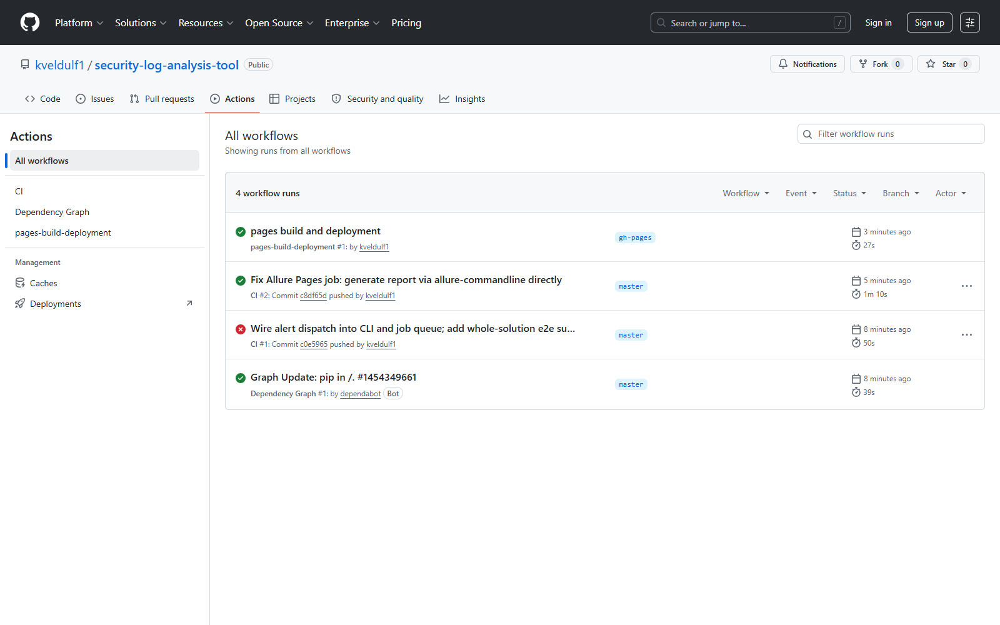
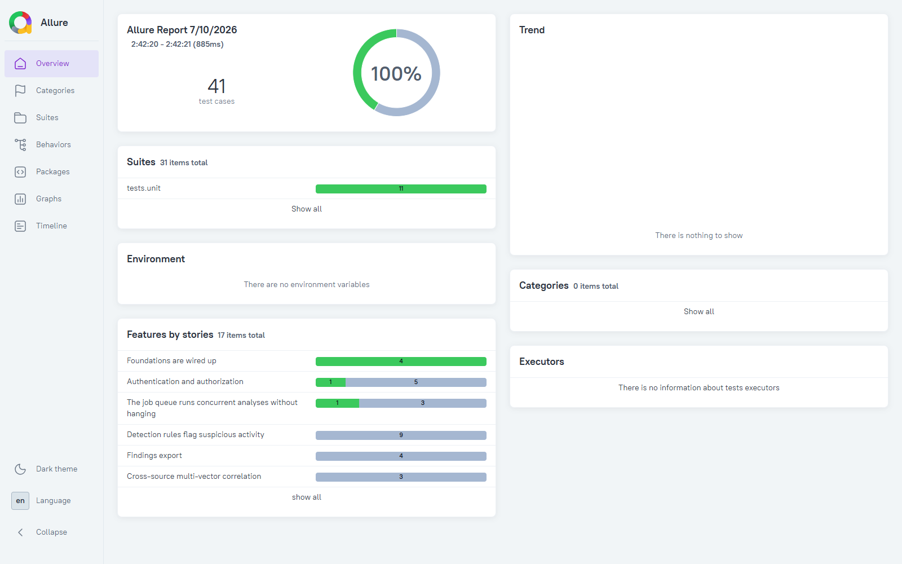
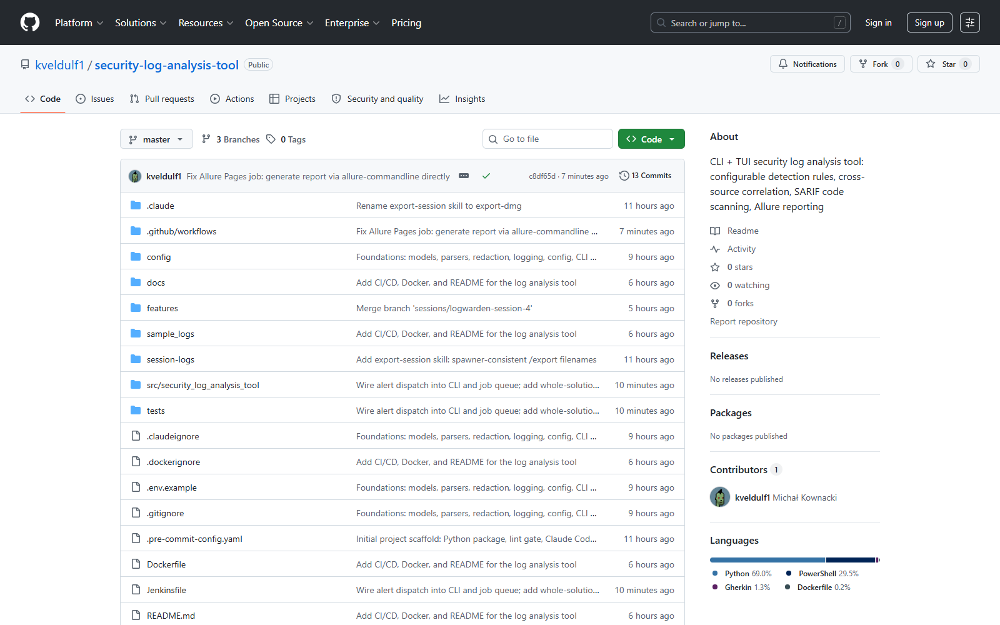
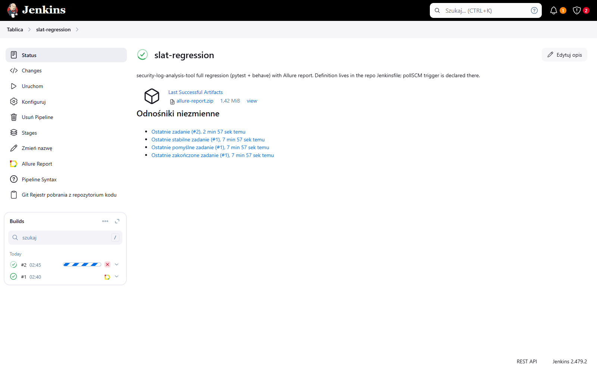
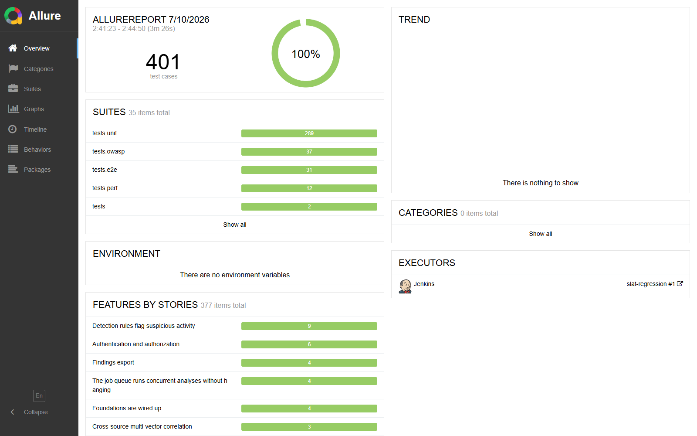
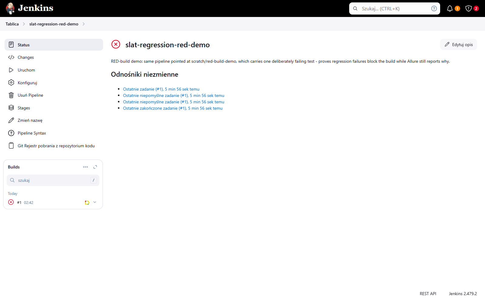
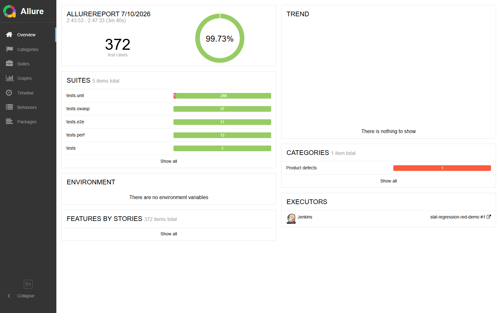

# End-to-end validation report

Final whole-solution validation evidence (logwarden session 7, 2026-07-10).
Every result below was produced against master after all six feature sessions
merged, with the alert-dispatch gap closed and all review findings fixed.

## 1. Test pyramid — all green

| Suite | Command | Result |
|---|---|---|
| Full pytest (unit, smoke, owasp, perf, e2e incl. TUI Pilot + installed-CLI subprocess) | `pytest -q` | 371 tests, exit 0 |
| BDD regression | `behave features` | 6 features / 30 scenarios / 102 steps passed |
| Lint & format | `ruff check .` + `ruff format --check .` + pre-commit | clean |
| Local Allure report | `pytest --alluredir=allure-results` + `behave -f allure_behave.formatter:AllureFormatter -o allure-results features` + `allure generate` | `file:///D:/security-log-analysis-tool/allure-report/index.html` |

## 2. Docker smoke

Image `slat` built from the repo `Dockerfile` (python:3.12-slim, non-root):

| Scenario | Expected | Result |
|---|---|---|
| `docker run --rm slat --help` | usage text, exit 0 | ✅ exit 0 |
| `docker run --rm -v <sample_logs>:/logs:ro -v <config>:/config:ro slat analyze /logs/access.log /logs/auth.log --rules /config/rules.yaml --no-alerts` | findings report, exit 1, BOTH showcase correlations | ✅ exit 1; CRITICAL multi-vector for 10.0.0.50 and 203.0.113.5 |
| same with `/logs/clean_access.log` | zero findings, exit 0 | ✅ exit 0, "0 finding(s) across 10 event(s)" |

## 3. GitHub Actions / SARIF / Pages

Repo: <https://github.com/kveldulf1/security-log-analysis-tool> (public).

- **CI run on master — all three jobs green** (after fixing the Pages job: the
  `simple-elf/allure-report-action` base image `openjdk:8-jre-alpine` was removed
  from Docker Hub; report generation now runs allure-commandline directly):
  - Smoke tests (pytest + behave): ✅
  - SARIF code scanning (sample logs): ✅
  - Publish Allure report to GitHub Pages: ✅

  

- **Code scanning**: 14 alerts live in Security → Code scanning, annotating the
  committed sample-log lines (verified via `gh api .../code-scanning/alerts`):

  ```text
  multi-vector-correlation     @ sample_logs/access.log:90
  multi-vector-correlation     @ sample_logs/access.log:81
  rapid-success-after-failures @ sample_logs/auth.log:55
  ssh-invalid-user-enum        @ sample_logs/auth.log:62
  sudo-sensitive-command       @ sample_logs/auth.log:68
  … (14 total)
  ```

  The Security tab UI is only rendered for an authenticated session with repo
  access, so it cannot be screenshotted anonymously — open
  <https://github.com/kveldulf1/security-log-analysis-tool/security/code-scanning>
  while logged in to view it.

- **GitHub Pages Allure report live**:
  <https://kveldulf1.github.io/security-log-analysis-tool/>

  

- Repo home with badges:

  

## 4. Jenkins (local, native Windows)

Local instance: `jenkins.war` on `http://127.0.0.1:8081` (jdk-22,
`--enable-future-java`), JENKINS_HOME = a user-writable copy of the existing
service home (`%LOCALAPPDATA%\jenkins-home`) — the installed Windows service
could not start because its `jenkins.xml` points at a JDK that is no longer
installed. Pipeline job `slat-regression` = "Pipeline script from SCM" →
GitHub repo, script path `Jenkinsfile` (pollSCM trigger declared there).

- **Green run** — build #1 SUCCESS: venv setup (`py -3`), `pip install -e .[dev]`,
  full `pytest` + `behave` regression, Allure report published by the
  `post { always { allure ... } }` block:

  
  

- **RED-build demo** ("can it fail the build?" — yes, and it should): job
  `slat-regression-red-demo` points at scratch branch `scratch/red-build-demo`
  carrying one deliberately failing test. The Regression stage fails, the build
  goes RED, and the Allure report still renders showing the failing test:

  
  

  Cleanup: the scratch branch was deleted after the demo (screenshots above are
  the durable evidence); both Jenkins jobs were left in place for inspection.

## 5. Alert hooks

`AlertDispatcher` is wired into both entry points (closed in session 7 — it
previously existed but was never invoked):

- `analyze` dispatches the full finding set to the sinks configured in
  `config/rules.yaml` unless `--no-alerts` is passed.
- Jobs completing on the `JobQueue` (the TUI path) dispatch via the queue's
  `on_done` hook, before the job's DONE status becomes visible.

Real SMTP send and toast visuals remain manual procedures —
see `docs/manual-tests.md` §1–2.
