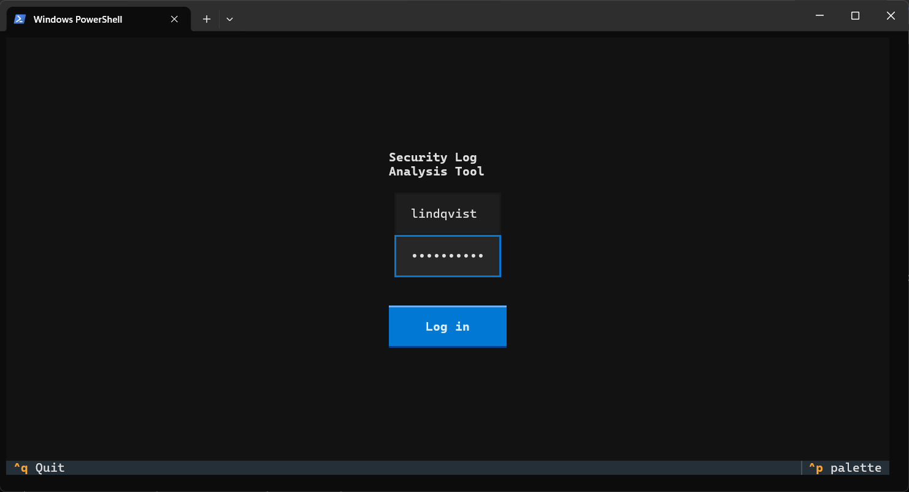
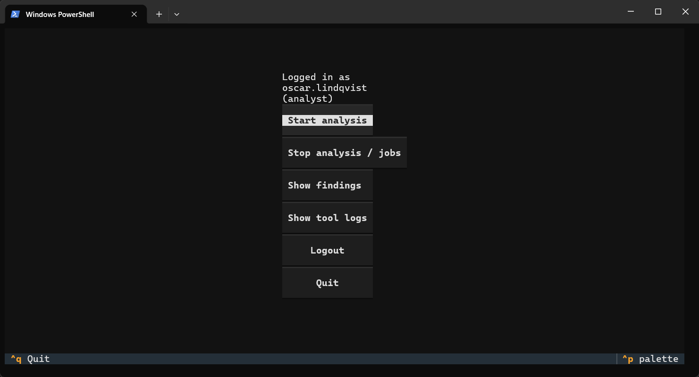
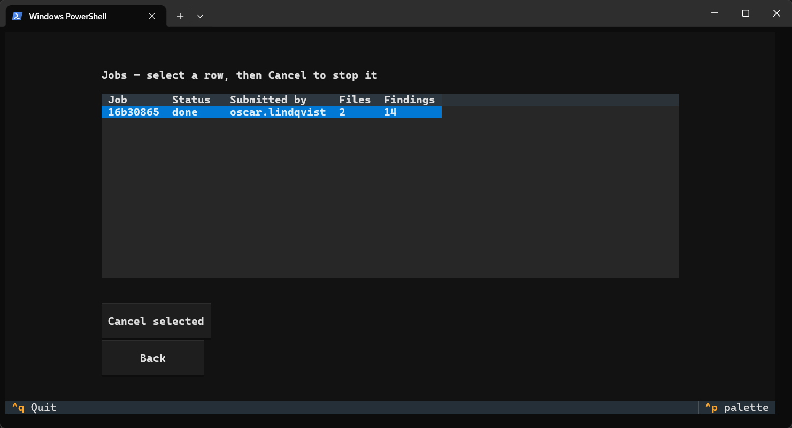
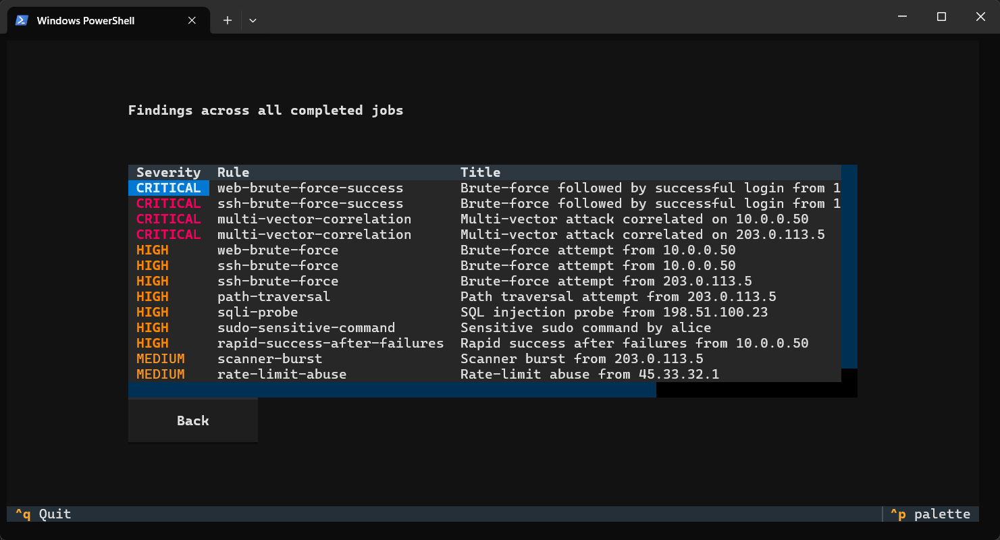
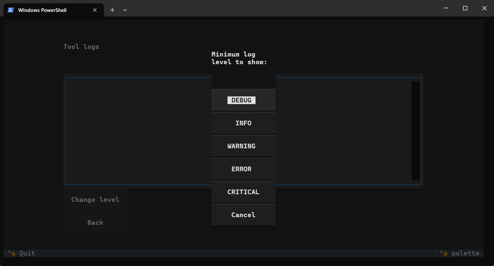

# End-to-end validation report

Final whole-solution validation evidence (logwarden session 7, 2026-07-10).
Every result below was produced against master after all six feature sessions
merged, with the alert-dispatch gap closed and all review findings fixed.

## 1. Test pyramid — all green

| Suite | Command | Result |
|---|---|---|
| Full pytest (unit, smoke, owasp, perf, e2e incl. TUI Pilot + installed-CLI subprocess) | `pytest -q` | 371 tests, exit 0 |
| BDD regression | `behave features` | 6 features / 30 scenarios / 102 steps passed |
| Lint & format | `ruff check .` + `ruff format --check .` + pre-commit | clean |
| Local Allure report | `pytest --alluredir=allure-results` + `behave -f allure_behave.formatter:AllureFormatter -o allure-results features` + `allure generate` | `file:///D:/security-log-analysis-tool/allure-report/index.html` |

## 2. Docker smoke

Image `slat` built from the repo `Dockerfile` (python:3.12-slim, non-root):

| Scenario | Expected | Result |
|---|---|---|
| `docker run --rm slat --help` | usage text, exit 0 | ✅ exit 0 |
| `docker run --rm -v <sample_logs>:/logs:ro -v <config>:/config:ro slat analyze /logs/access.log /logs/auth.log --rules /config/rules.yaml --no-alerts` | findings report, exit 1, BOTH showcase correlations | ✅ exit 1; CRITICAL multi-vector for 10.0.0.50 and 203.0.113.5 |
| same with `/logs/clean_access.log` | zero findings, exit 0 | ✅ exit 0, "0 finding(s) across 10 event(s)" |

## 3. GitHub Actions / SARIF / Pages

Repo: <https://github.com/kveldulf1/security-log-analysis-tool> (public).

- **CI run on master — all three jobs green** (after fixing the Pages job: the
  `simple-elf/allure-report-action` base image `openjdk:8-jre-alpine` was removed
  from Docker Hub; report generation now runs allure-commandline directly):
  - Smoke tests (pytest + behave): ✅
  - SARIF code scanning (sample logs): ✅
  - Publish Allure report to GitHub Pages: ✅

  

- **Code scanning**: 14 alerts live in Security → Code scanning, annotating the
  committed sample-log lines (verified via `gh api .../code-scanning/alerts`):

  ```text
  multi-vector-correlation     @ sample_logs/access.log:90
  multi-vector-correlation     @ sample_logs/access.log:81
  rapid-success-after-failures @ sample_logs/auth.log:55
  ssh-invalid-user-enum        @ sample_logs/auth.log:62
  sudo-sensitive-command       @ sample_logs/auth.log:68
  … (14 total)
  ```

  The Security tab UI is only rendered for an authenticated session with repo
  access, so it cannot be screenshotted anonymously — open
  <https://github.com/kveldulf1/security-log-analysis-tool/security/code-scanning>
  while logged in to view it.

- **GitHub Pages Allure report live**:
  <https://kveldulf1.github.io/security-log-analysis-tool/>

  

- Repo home with badges:

  

## 4. Jenkins (local, native Windows)

Local instance: `jenkins.war` on `http://127.0.0.1:8081` (jdk-22,
`--enable-future-java`), JENKINS_HOME = a user-writable copy of the existing
service home (`%LOCALAPPDATA%\jenkins-home`) — the installed Windows service
could not start because its `jenkins.xml` points at a JDK that is no longer
installed. Pipeline job `slat-regression` = "Pipeline script from SCM" →
GitHub repo, script path `Jenkinsfile` (pollSCM trigger declared there).

- **Green run** — build #1 SUCCESS: venv setup (`py -3`), `pip install -e .[dev]`,
  full `pytest` + `behave` regression, Allure report published by the
  `post { always { allure ... } }` block:

  
  

- **RED-build demo** ("can it fail the build?" — yes, and it should): job
  `slat-regression-red-demo` points at scratch branch `scratch/red-build-demo`
  carrying one deliberately failing test. The Regression stage fails, the build
  goes RED, and the Allure report still renders showing the failing test:

  
  

  Cleanup: the scratch branch was deleted after the demo (screenshots above are
  the durable evidence); both Jenkins jobs were left in place for inspection.

## 5. Alert hooks

`AlertDispatcher` is wired into both entry points (closed in session 7 — it
previously existed but was never invoked):

- `analyze` dispatches the full finding set to the sinks configured in
  `config/rules.yaml` unless `--no-alerts` is passed.
- Jobs completing on the `JobQueue` (the TUI path) dispatch via the queue's
  `on_done` hook, before the job's DONE status becomes visible.

Real SMTP send and toast visuals remain manual procedures —
see `docs/manual-tests.md` §1–2.

## 6. TUI walkthrough (visual evidence)

The Textual TUI is exercised headlessly by the Pilot suite
(`tests/e2e/test_tui_pilot.py`, counted in the 371 pytest total above), but a
full-screen interactive app is best shown running. The shots below are a live
run on Windows PowerShell, following `docs/manual-tests.md` §3, launched with:

```powershell
# after `pip install -e .` — the console script:
security-log-analysis-tool tui
# if that folder isn't on PATH, the PATH-independent equivalent:
python -c "from security_log_analysis_tool.cli import main; main()" tui
```

- **Login** — role-scoped auth screen; password masked, `^q` quits:

  

- **Main menu (analyst)** — logged in as `oscar.lindqvist (analyst)`; the
  analyst role sees analysis/findings/logs, no admin-only options:

  

- **Jobs** — an analysis of the two sample logs ran to completion: job
  `16b30865`, status `done`, 2 files, 14 findings; a running/queued job can be
  selected and cancelled here:

  

- **Findings** — severity-colored table across completed jobs: the two
  `multi-vector-correlation` CRITICALs (10.0.0.50 and 203.0.113.5) plus the
  brute-force/path-traversal/SQLi/sudo/scanner/rate-limit findings — matching
  the SARIF alerts in §3:

  

- **Tool logs** — live log view with an in-app level picker
  (DEBUG…CRITICAL); choosing a level filters the view to that level and above:

  

## 7. Test coverage summary & known gaps

Taken together, the sections above are the delivery evidence that the product
works end to end:

| Layer | Evidence | Where |
|---|---|---|
| Unit / smoke / OWASP / perf | 371 pytest tests, exit 0 | §1 |
| BDD regression | `behave`: 6 features / 30 scenarios / 102 steps | §1 |
| Lint & format | ruff + pre-commit clean | §1 |
| Merged Allure report | pytest + behave into one report | §1 |
| Container | Docker build + analyze runs (exit 0 / exit 1) | §2 |
| CI + supply chain | GitHub Actions green, SARIF code-scanning, Pages Allure | §3 |
| Regression gate | Jenkins green run **and** RED-build demo (proves it blocks) | §4 |
| Alert wiring | `AlertDispatcher` invoked from both `analyze` and the `JobQueue` path | §5 |
| Interactive TUI | live walkthrough — login, jobs, findings, tool logs | §6 |

**Automated coverage of the alerting path** (no live credentials needed):

- **Email sink** — `tests/unit/test_alerts_email.py` drives a real in-process
  `aiosmtpd` SMTP server on localhost: message construction, delivery, empty-set
  no-send, unreachable-host error handling, env-config building, and
  **secret redaction in the email body** are all asserted.
- **Toast sink** — `tests/unit/test_alerts_toast.py`; **dispatcher** —
  `tests/unit/test_alert_dispatcher.py`; **factory** —
  `tests/unit/test_alerts_factory.py`.

**Known gap — deferred for time (not a defect):** the two *manual, human-only*
alert procedures were **not executed** in this delivery window because they need
live external resources and a person at the screen:

- **`docs/manual-tests.md` §1 — real SMTP send to a live mailbox.** Never run:
  it requires a real provider account + app password (a credential we were never
  prompted for and intentionally did not enter). The SMTP *logic, redaction, and
  env wiring* are covered by the automated tests above; what remains unverified
  is only a real STARTTLS-authenticated delivery to an external inbox.
- **`docs/manual-tests.md` §2 — desktop toast visual.** Never captured: it needs
  an interactive Windows desktop session. The toast sink's code path is
  unit-tested (`test_alerts_toast.py`); only the on-screen visual is unconfirmed.

Both are documented, copy-pasteable procedures ready to run when a real inbox /
desktop is available — closing them is a matter of executing the checklist, not
of writing or fixing code.
