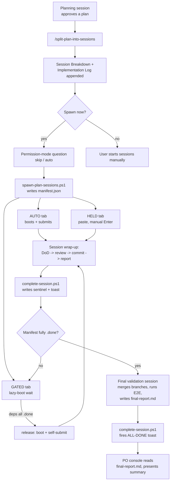
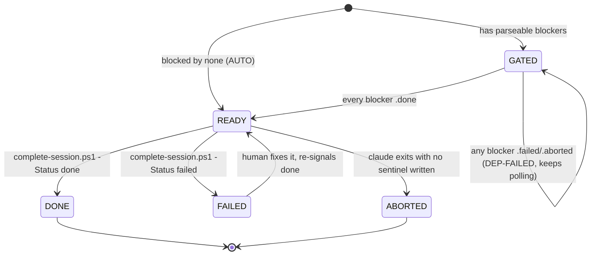
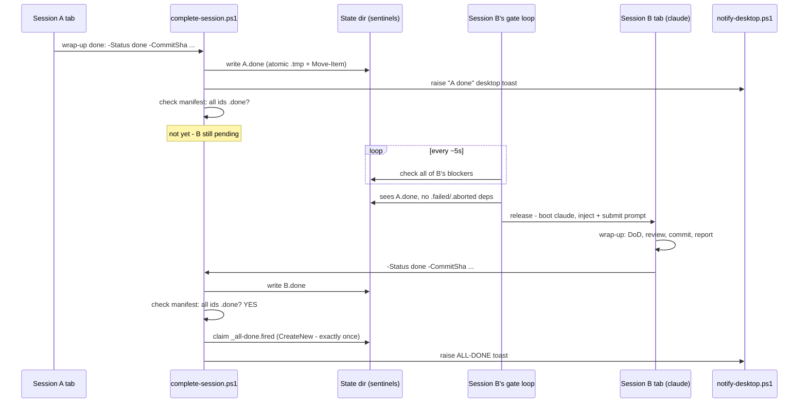

# Orchestrated multi-session workflow

> **Provenance.** This document is reproduced from the author's personal Claude Code toolkit
> (`claude-workspace-seeder`). It describes the orchestration workflow used to build
> *security-log-analysis-tool*: this project's master plan was carved into 7 dependency-gated
> sessions and run across parallel git worktrees — the original brief is under
> [`session-logs/prompt/`](../session-logs/prompt/), the plan and per-session prompts under
> [`session-logs/plans/`](../session-logs/plans/), and the verbatim transcripts under
> [`session-logs/logs/`](../session-logs/logs/).

---

How a large plan goes from a single approved plan file to N+1 self-coordinating Claude Code
sessions that unblock each other, report their own results, and notify you when something needs
attention — with no human pressing Enter on a blocked tab, and no agent sitting in a polling loop.

This document describes the machinery as built (session-1 through session-5 of the
`workflow-orchestration-upgrade` plan). It is not aspirational: every claim below was verified live
during those sessions, or is flagged as an open caveat where current-day Claude Code CLI behavior
has since drifted from what the design assumed (see *Notification-hook caveat* in the Runbook).

## Overview

**The pipeline, start to finish:**

1. **Plan.** You write and approve an implementation plan in a normal chat session (any model).
2. **Split.** `/split-plan-into-sessions <plan-file>` carves it into 3–7 focused implementation
   sessions **plus one mandatory final validation session**, appends a `## Session Breakdown` and
   `## Implementation Log` to the plan file, and prints a concurrency matrix (which sessions are
   parallel-safe, in which waves).
3. **Permission question.** The planning session offers to run `spawn-plan-sessions.ps1` for you.
   The spawner asks a one-time numeric question — *"Spawn tabs with which permission mode? [1]
   --dangerously-skip-permissions  [2] auto (--permission-mode auto)"* — unless `-Permissions
   skip|auto` was already given.
4. **Spawn.** The spawner writes a `manifest.json` once (the static DAG: session ids, models,
   `blockedBy`, computed `role`, permission mode) under `$env:USERPROFILE\.claude\orchestration\
   <plan-slug>\`, then opens one named Windows Terminal tab per session:
   - **AUTO** tabs (`blocked by none`) boot immediately and self-submit.
   - **GATED** tabs (parseable `blocked by <ids>`) lazy-boot: they sit in plain PowerShell (no
     `claude` process yet) polling sentinel files, and only launch + self-submit once every
     blocker is `.done`.
   - **HELD** tabs (unparseable prose, or no `Parallelization` line) paste the prompt but wait for
     a human Enter — the legacy fallback.
5. **Work + wrap-up.** Each session does its scope, then a fixed wrap-up: DoD green (positive **and**
   negative) → `/code-review` gate (fix CONFIRMED findings, flag SOLID violations) → auto-commit
   per `commit-policy` → write a report to `reports\<id>-report.md` → signal
   `complete-session.ps1 -Status done|failed`.
6. **Unblock.** `complete-session.ps1` writes the session's sentinel (`.done`/`.failed`/`.aborted`),
   fires a desktop toast, and — if a manifest exists — reports which dependents are now unblocked.
   Every GATED tab whose blockers are all `.done` releases and self-submits within its poll
   interval; no one presses Enter.
7. **Final validation.** The generated `<plan-slug>-session-<N+1>` is blocked by *every* other
   session. It merges/verifies each branch, folds any remaining `*.implog.md` fragments into the
   plan's Implementation Log, runs whole-solution E2E (positive + negative), consolidates every
   per-session report into `<plan-slug>-final-report.md`, commits, and signals `done` — since
   everything else depends on it, **its sentinel is the one that fires the ALL-DONE toast**.
8. **PO console.** The planning session from step 2 never actually ends — it stays open as the
   **product-owner console** for the plan, reacting only when spoken to (`"status?"`, a FAILED
   report, ALL-DONE). Its first move is telling you to run `/model opus[1m]`: planning itself should
   run at high effort (Fable 5 @ xhigh, or Opus 4.8 @ xhigh), but the PO phase — status checks,
   diagnosis — is mechanical and wants a cheap huge-context model instead, so it downshifts to
   `opus[1m]`; there is no programmatic mid-session model switch for the skill to invoke itself.

**Where every artifact lives** (all outside any repo, so nothing needs a `.gitignore` entry and
state survives worktree pruning):

| Artifact | Path |
|---|---|
| Manifest (static DAG) | `$env:USERPROFILE\.claude\orchestration\<plan-slug>\manifest.json` |
| Cold-start prompts | `...\orchestration\<plan-slug>\prompts\<id>.txt` |
| Per-session reports | `...\orchestration\<plan-slug>\reports\<id>-report.md` |
| Sentinels | `...\orchestration\<plan-slug>\<id>.done|.failed|.aborted` |
| Gate-watcher trace | `...\orchestration\<plan-slug>\gate\<id>.gate.log` |
| ALL-DONE claim marker | `...\orchestration\<plan-slug>\_all-done.fired` |
| Prior runs (`-Reset`) | `...\orchestration\<plan-slug>\archive\<utc-stamp>\...` |
| Final consolidated report | `<plan-slug>-final-report.md`, next to the plan file (inside the repo — this one *is* committed) |

**Which model runs what:**

| Role | Model | Why |
|---|---|---|
| Planning / carving | **Fable 5 @ xhigh** (or **Opus 4.8 @ xhigh** if Fable is unavailable) | The highest-leverage step in the whole workflow: it defines the DAG, the concurrency matrix, and every session's DoD. A weak plan multiplies into N bad sessions, so planning gets top reasoning effort - never cheap drafting. |
| PO console (after spawning) | `opus[1m]` (user runs `/model opus[1m]`) | Status/diagnosis wants cheap huge context, not planning-grade judgement. |
| Per-session implementation | Opus 4.8 / Sonnet 5 (per session, from the model table) | Foundation and judgement-heavy work gets Opus; mechanical wrapping gets Sonnet. |
| Final validation session | Opus 4.8, or Fable 5 for architecture-heavy plans | Integration-level judgement across every branch. |
| Oracle consult | Fable 5 @ high (user default), or Opus @ xhigh | Chosen once at seed time; see *Oracle usage* below. |

## Diagram 1 — end-to-end pipeline



## Diagram 2 — session state machine

Applies per session id. `GATED` only exists for sessions with a parseable `blocked by`; `AUTO`
sessions start straight at `READY`.



The gate rule, in one line: **a dependent releases iff every blocker is `.done` and none is
`.failed`/`.aborted`.** A `.failed` or `.aborted` sentinel holds *every* dependent — forever, until
a human fixes the underlying session and re-signals `done` — which is exactly what flips a stuck
`GATED` node back onto the path to `READY` in the diagram above.

## Diagram 3 — an unblock event

Session A finishes; session B was waiting on it alone.



## Runbook

### Checking progress

```powershell
& "$env:USERPROFILE\.claude\scripts\orchestration-status.ps1" -PlanSlug '<plan-slug>'
```
Prints an `ID | MODEL | ROLE | DEPS | STATE | SHA | FINISHED-UTC | REPORT` table; STATE is derived
purely from the manifest + sentinels on disk (`DONE / FAILED / ABORTED / DEP-FAILED / GATED /
READY`). Exit 1 if anything is `FAILED`/`ABORTED` (scriptable). With no `-PlanSlug`/`-StateDir`, it
enumerates every known plan under `orchestration\`, one line each.

### Failure recovery

1. `orchestration-status.ps1` shows the failing id and any `DEP-FAILED` dependents.
2. Read `reports\<id>-report.md` and, if it went through a gate, `gate\<id>.gate.log`.
3. Fix the problem in that session's tab (or, if the tab is gone, re-launch it with the invocation
   `spawn-plan-sessions.ps1` printed for it).
4. Re-signal: `complete-session.ps1 -SessionId <id> -Status done -CommitSha <sha> -Summary "..."`.
5. Every dependent's gate loop picks this up on its next ~5s poll and releases automatically — no
   need to touch the dependents at all.

### `-Reset` / `-Resume`

- A bare re-run of `spawn-plan-sessions.ps1` over an existing manifest/sentinel state aborts
  (exit 1) — a stale `.done` must never silently release a gated tab.
- `-Reset` archives the existing state under `archive\<utc-stamp>\` (**never deletes** — reports
  are history) and starts clean.
- `-Resume` re-runs the same plan: sessions already `.done` print `SKIP (done)` and get no tab
  (idempotent re-spawn). It validates `manifest.planFile` matches the plan you're pointing at
  (exit 1 on a moved/renamed plan) and warns on a plan-file hash drift.

### Abort semantics

If `claude` exits (`/exit`, Ctrl+C, crash) without that session having signaled completion, the tab
runner writes an `.aborted` sentinel itself (`complete-session.ps1 -Status aborted -SkipIfFinished`)
— dependents hold exactly like a `.failed` dep. A **hard tab kill** (closing the window, not
`/exit`) leaves no sentinel at all: this fails safe (dependents just stay `GATED` forever) but is
silent — recover by re-running that session's printed invocation, or hand-signaling
`complete-session.ps1` yourself once you've confirmed the real state.

### Lazy-boot gate behavior

A GATED tab does **not** launch `claude` up front. It sits in plain PowerShell — a few MB, zero
tokens, no claude process — with the tab titled `[WAIT] <id>` and its dependency list printed,
polling sentinels every ~5 seconds. On release the title flips to `[RUN] <id>`, `claude` boots, and
the prompt is injected and submitted automatically. Every transition is logged to
`gate\<id>.gate.log`. **Force-launch override:** pressing any key while a tab is still `[WAIT]`
launches `claude` immediately with the prompt pasted but **not submitted** — you've taken manual
control, so don't type into a `[WAIT]` tab unless you mean to do this.

### Notification matrix

| Event | Surfaces as |
|---|---|
| A session finishes (done/failed) | Desktop toast via `complete-session.ps1` → `notify-desktop.ps1`, distinct sounds for done/failed/alldone |
| Every session in the manifest is `.done` | Exactly one ALL-DONE toast (claimed via `_all-done.fired`, `CreateNew` — the winner fires, any other finisher stays silent) |
| A tab needs human input (`--permission-mode auto` prompting for a non-edit action, or an idle wait) | Desktop toast via the `Notification` hook → `notify-input-needed.ps1` → `notify-desktop.ps1 -Kind input`, titled `Input needed: <label>`. **Focus-gated** — reliably fires when the tab is unfocused (the unattended-spawn case); see the focus-gating note below. |
| A session's transcript `.jsonl` is not on disk (Stop hook, boot watcher, or tab-exit check) | Desktop toast via `check-transcript-stop.ps1` / `verify-session-boot.ps1` → `notify-desktop.ps1 -Kind failed`, titled `Transcript MISSING: <label>` (or `Session capture NOT running: <label>` when the SessionStart hook never fired). Debounced to one per session. Body tells you to `/export` before closing the tab. |
| Any of the above, on the Claude iOS app | Built-in push only (`agentPushNotifEnabled`, `inputNeededNotifEnabled`) — no custom message, no per-event config, no model-callable push tool from the CLI. Per-session detail is desktop-only; iOS gets the generic built-in push. |

**Notification-hook caveat (found 2026-07-07, during session-5's live payload test):** the actual
stdin JSON fields are `session_id`, `transcript_path`, `cwd`, `prompt_id`, `hook_event_name`
(`"Notification"`), `message`, and **`notification_type`** — the settings.json `matcher` (e.g.
`permission_prompt|idle_prompt`) matches against `notification_type`, not a bare top-level field
named after the matcher. `CLAUDE_SESSION_LABEL` env-var inheritance from the spawning shell through
to the hook subprocess was confirmed live (a session launched with `$env:CLAUDE_SESSION_LABEL` set
produced a hook payload carrying that exact value). Separately: the installed CLI's own release
notes (`v2.1.201`) note that idle-timeout notifications are moving to an **opt-in** model, and a
benign non-destructive Bash command run under `--permission-mode auto` did **not** visibly trigger
a `permission_prompt` in an ad hoc test — both are behavior areas that may have shifted since this
plan's design and are worth re-confirming against whatever CLI version is installed when you rely
on this notification path.

**Focus-gating (confirmed 2026-07-08, F2):** the input-needed toast is **focus-gated by Claude
Code** — while you are actively viewing a tab it suppresses the `Notification`, and it fires when the
tab is **unfocused**, which is exactly the unattended parallel-spawn case this whole flow targets.
This is why an `--permission-mode auto` approval prompt can seem to raise no toast when you are
watching that tab: in session-6 the same prompt raised **no** toast while focused but **did** the
moment the tab lost focus. The hook path itself is proven end to end: a live `Notification` was
captured through the hook carrying `"notification_type":"idle_prompt"` and
`"message":"Claude is waiting for your input"`, matched by the broadened matcher
(`permission_prompt|idle_prompt|agent_needs_input|elicitation_dialog`) and forwarded to the toast
with the resolved session label. Practical upshot: do not judge the notification path by whether a
toast appears while you are staring at the tab — it is designed to reach you when you have looked
away, and it does.

### Transcript-persistence guard

**Motivation (the incident) and root cause (confirmed).** A PowerShell crash once killed a full run of
spawned tabs whose main conversation transcript (`~/.claude\projects\<slug>\<uuid>.jsonl`) had **never
been flushed to disk** — only the `<uuid>\subagents|workflows` sidecars existed. Those conversations
were gone for good. The **root cause is now confirmed** (reproduced and fixed live): when the spawner
is launched from a Claude Code session that is itself a *bridge child* — Claude running inside a
claude.ai web/mobile session exports `CLAUDE_CODE_CHILD_SESSION=1`, `CLAUDE_CODE_BRIDGE_SESSION_ID` and
`CLAUDE_CODE_SESSION_ID` — those vars are **inherited by every spawned tab**, so each `claude` boots as
a bridge child that streams the conversation to the cloud bridge instead of writing a local `.jsonl`,
leaving `claude --resume <uuid>` with nothing to open. It is not `--name`, the model/effort flags, the
injection, or the permission mode (all ruled out by a one-variable-at-a-time ladder). `spawn-session-tab.ps1`
now **scrubs those bridge/child vars just before launching `claude`** (a no-op when the spawner is run
from a plain terminal, which has none), so every spawned tab boots as an independent, locally-persisted,
resumable session. The guard still runs regardless — it detects the *symptom* (a missing transcript)
whatever the cause, including a genuine future one.

**Three layers**, all seeded into a project (`.claude\scripts\` + `settings.json`), all fail-open
(never break a session), all writing evidence to the state dir so a crash can't erase it:

1. **Capture** — the `SessionStart` hook (`capture-session-start.ps1`) records the real Claude UUID +
   transcript path to `gate\<id>.session` and to `~/.claude\logs\session-registry.log`. This is the
   label→UUID map that lets `claude --resume <uuid>` work, and it never existed before.
2. **Detect** — the `Stop` hook (`check-transcript-stop.ps1`) confirms the `.jsonl` exists after every
   turn; the boot watcher (`verify-session-boot.ps1`, spawned per tab) and the tab runner's post-exit
   check cover the "hook never fired / no turn completed" cases. A miss → marker + gate-log line + one
   debounced `-Kind failed` toast (see the matrix row above).
3. **Snapshot** — the human-readable copy is the user-typed `/export session-logs\<id>-vN.txt` (and
   `-final.txt` at wrap-up). The model can't invoke the `/export` built-in, so every session prints the
   exact command as its last line (baked into the cold-start wrap-up).
4. **Recover** — `resume-session.ps1 -Id <label> -PlanSlug <slug>` turns a captured session back into
   `claude --resume <uuid>` from its recorded cwd when the transcript is on disk (honest "not resumable"
   verdict + `/export` pointer when it isn't); `-Uuid <uuid>` resumes a pre-guard session straight from
   `~/.claude\projects\`. `-DryRun` prints the command without launching.

`orchestration-status.ps1` surfaces this as `UUID` + `TRANSCRIPT` columns and exits 1 on any `MISSING`.
Retrofit a pre-guard project with `register-transcript-hooks.ps1 -ProjectPath <dir>`. Retention of the
underlying `.jsonl` is extended to a year via `cleanupPeriodDays: 365` in the global settings (README,
"Deploying changes").

### Oracle usage + tie-break

Consult the read-only `oracle` agent (`~/.claude/agents/oracle.md`, seeded at **Fable 5 @ high** by
default, or **Opus @ xhigh** if you answered "n" to the Fable question at seed time) when: stuck
after 2 failed attempts on the same problem, facing an architecture-risk fork, or about to abandon
a Definition-of-Done item. It reads the repo itself (fresh context, no anchoring on your framing)
and returns a diagnosis, 2–3 options with trade-offs, one recommendation, and what to verify
afterwards. **Tie-break:** the oracle wins on architecture/correctness questions; the calling
session wins on local mechanics and implementation detail it has more direct context on. It has no
Edit/Write tools and never modifies files or state.

### PO console usage

Once sessions are spawned, the planning chat becomes the PO console. It never polls — it only
reacts:

- **"status?"** → runs `orchestration-status.ps1` and summarizes against the concurrency matrix.
- **A FAILED / DEP-FAILED report** → reads the report + gate log, diagnoses, guides the fix in that
  session's tab (or respawns it), then waits for the re-signal.
- **ALL-DONE** → reads `<plan-slug>-final-report.md` and presents the executive summary.
- **DAGs of more than 8 sessions** → after roughly half have signaled done, proactively re-reads
  every report plus the remaining session specs and confirms or replans them (the mid-plan
  checkpoint — a plan-staleness guard for long-lived DAGs, not a capability limit).

Its first action on entering PO mode is telling you to run `/model opus[1m]` — no programmatic
mid-session model switch exists for the skill to invoke on its own.

### Permission-mode trade-offs

| Mode | Launch flag | Behavior | Trade-off |
|---|---|---|---|
| `skip` | `--dangerously-skip-permissions` | Fully unattended — nothing prompts. | Fastest, but no safety net if a session goes off-script; default answer for unattended runs. |
| `auto` | `--permission-mode auto` | Edits auto-accepted; other actions (Bash, etc.) still prompt. | Safer for actions with side effects, but a tab can stall waiting for approval while you're away — mitigated by the `Notification` hook's "Input needed" toast + iOS input push, not eliminated. |

## Concurrency & machine profile

**Session-count cap is now soft.** Recommend ≤ 7 implementation sessions by default; allow more
(e.g. 13) on explicit user opt-in when natural module boundaries genuinely produce more. The cap
guards **human review bandwidth** (one PR to review per session) and **plan staleness** (a
long-lived DAG drifts from the live codebase) — not capability, since orchestration removes the old
manual-coordination cost that originally motivated it. Going beyond 7 requires the concurrency
matrix to still verify pairwise-disjoint write targets for every session pair (O(n²): 21 pairs at
7 sessions, 78 at 13 — build it as an explicit table, never eyeball it), and DAGs over 8 sessions
add the PO's mid-plan checkpoint.

**Wave width is capped by hardware, not by session count.** This machine profile: Intel i7-1165G7
(4 cores / 8 threads), 23.8 GB RAM with roughly 4.5 GB typically free, measured ~250–450 MB per
active `claude` TUI process plus whatever test/build processes that session's work spawns. More
than 2–3 concurrently **working** sessions contends heavily on 4 physical cores and pushes free RAM
into swap during real test/build runs — so waves stay at **≤ 2–3 concurrently working sessions**
regardless of total DAG size.

**Lazy boot is what makes wide DAGs affordable.** A `GATED` tab waiting in plain PowerShell costs a
few MB; an eagerly-booted idle `claude` TUI costs ~0.3–0.5 GB. Pre-spawning all tabs up front (as
this design does) would not fit in free RAM for a 13-session DAG if every tab booted `claude`
immediately — lazy boot means only the 2–3 tabs actually *working* at any moment pay the TUI memory
cost; everything else waits cheaply.

**Disk guidance for `-PerSessionWorktrees`.** A worktree is a full checkout on the target repo's
drive. Check free space before a wide parallel wave on a large repo — as a data point, this repo's
drive (`D:`) had roughly 18 GB free at the time this plan was written.
